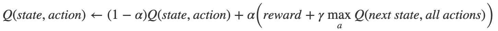

# SmartCab

## Structure
+ Assignment: contains the actual assignment. 
+ CartPole: An example of gym.openai combined with DQN. Runnable and trainable.
+ ``main.py``: skeleton for the assignment, here you can adjust code. 

## Game


Let's design a simulation of a self-driving cab: SmartCab. Above you see SmartCab's environment.

The SmartCab's job is to pick up the passenger at one location and drop them off in another. 
Here are a few things for SmartCab to take care of:
+ Drop off the passenger to the right location.
+ Save passenger's time by taking minimum time possible to drop off
+ Take care of passenger's safety and traffic rules

About the environment:
+ It's a 5 x 5 grid. Current taxi location(3,1). 
+ There are four locations where you can pick- and drop of a passenger. (R,G,B,Y)
+ The environment has a total of 500(5 x 5 x 5 x 4) states: 
    - 5 x 5 : for the grid
    - x 5 : for passenger location(R,G,B,Y and in Cab)
    - x 4 : for pick- and drop-off locations
    - Code reference: ``env.observation_space``
    
There are six possible movements for the cab(Code reference ``env.action_space``): 
+ 0 = south
+ 1 = north
+ 2 = east
+ 3 = west
+ 4 = pickup
+ 5 = dropoff

When the environment is created there is an initial Reward table that's also created, called `P`. 
For each state *x* you can call the Reward Table by ``env.P[x]``. The response has the following structure: 
 - ``{action: [(probability, nextstate, reward, done)]}`` , where:  
    + Probability is always ``1.0``. 
    + next state is the *numeric* description of the next state. 
    + Reward: 
    All the movement actions have a -1 reward and the pickup/dropoff actions have -10 reward. 
    If we are in a state where the taxi has a passenger and is on top of the right destination, 
    we would see a reward of 20 at the dropoff action (5).
    
    
## Q-learning
Essentially, Q-learning lets the agent use the environment's rewards to learn, over time, 
the best action to take in a given state.

In our Taxi environment, we have the reward table, P, that the agent will learn from. 
It does thing by looking receiving a reward for taking an action in the current state, 
then updating a Q-value to remember if that action was beneficial.

The values store in the Q-table are called a Q-values, and they map to a ``(state, action)`` combination.

A Q-value for a particular state-action combination is representative of the "quality" of an action taken from that state. 
Better Q-values imply better chances of getting greater rewards.

Q-values are initialized to an arbitrary value, and as the agent exposes itself to the environment and receives different rewards by executing different actions, 
the Q-values are updated using the equation:



Where:

- α (alpha) is the learning rate (0<α≤1) 
Just like in supervised learning settings, α is the extent to which our Q-values are being updated in every iteration.


- γ (gamma) is the discount factor (0≤γ≤1) 
determines how much importance we want to give to future rewards. 
A high value for the discount factor (close to 1) captures the long-term effective award, whereas, 
a discount factor of 0 makes our agent consider only immediate reward, hence making it greedy.

What is this saying?

We are assigning (←), or updating, the Q-value of the agent's current state and action by first taking a weight (1−α) 
of the old Q-value, then adding the learned value. 
The learned value is a combination of the reward for taking the current action in the current state, 
and the discounted maximum reward from the next state we will be in once we take the current action.

Basically, we are learning the proper action to take in the current state by looking at the reward for the current state/action combo,
 and the max rewards for the next state. 
 This will eventually cause our taxi to consider the route with the best rewards strung together.

The Q-value of a state-action pair is the sum of the instant reward and the discounted future reward (of the resulting state). 
The way we store the Q-values for each state and action is through a Q-table

Q-Table
The Q-table is a matrix where we have a row for every state (500) and a column for every action (6). 
It's first initialized to 0, and then values are updated after training. 
Note that the Q-table has the same dimensions as the reward table, but it has a completely different purpose.

## Summing up the Q-Learning Process
Breaking it down into steps, we get: 

- [x] Initialize the Q-table by all zeros. 
- [ ] Start exploring actions: For each state, select any one among all possible actions for the current state (S).
- [ ] Travel to the next state (S') as a result of that action (a).
- [ ] For all possible actions from the state (S') select the one with the highest Q-value.
- [ ] Update Q-table values using the equation.
- [ ] Set the next state as the current state.
- [ ] If goal state is reached, 

There's a tradeoff between exploration (choosing a random action) and exploitation (choosing actions based on already learned Q-values).
We want to prevent the action from always taking the same route, and possibly overfitting, 
so we'll be introducing another parameter called ϵ "epsilon" to cater to this during training.

Pseudo code algorithm: 

````
        random = random number between 0 and 1
        If random < epsilon then 
            action = random action
        Else
            action = take max value(best move) of q-table this is often 0 in the beginning.
        EndIf

        next_state =  next_state of action
        reward = reward of action
        done = check if action leads to done
        info = this is optional doesn't have to be filled
        
        old_value = get the old value of the q-table

        next_max = get the max value of the q-table to define your next best move. 
        
        new_value = calculate the new value which you want to store in the q-table, HINT: use formula. 
        
        q_table[state, action] = new_value
````

You can find within the code where to put the algorithm, training will take between 30 and 60 seconds. 

I've adjusted an assignment from the web, you can find it [here](https://www.learndatasci.com/tutorials/reinforcement-q-learning-scratch-python-openai-gym/). Do not try to cheat :-). 
